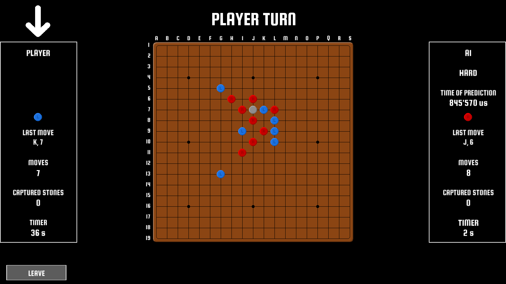
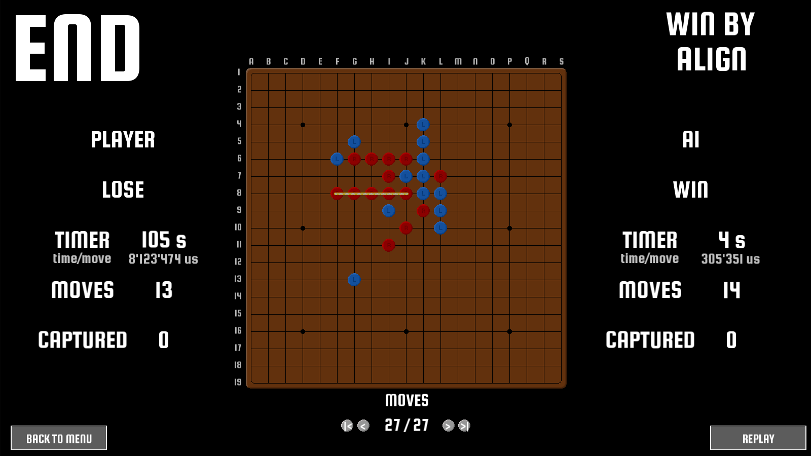
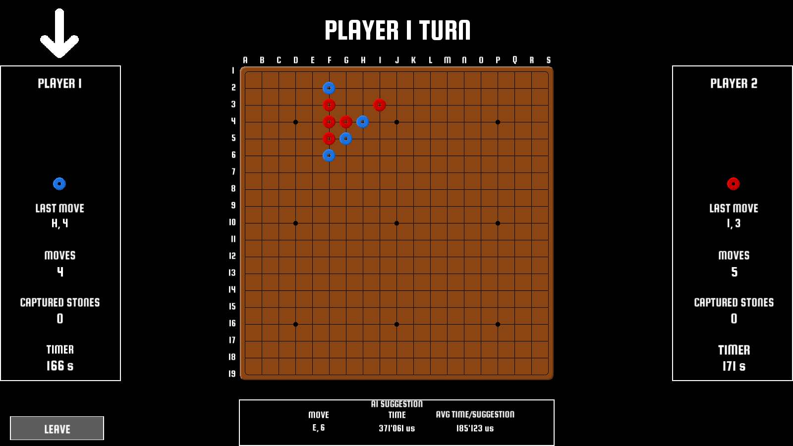
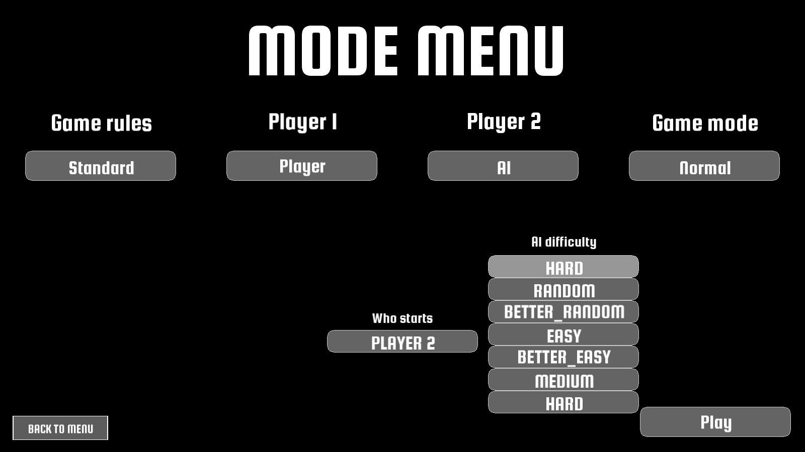

# 🎮 Gomoku — AI Strategy Game

<p align="center">
  <strong>Intelligence artificielle de jeu Gomoku avec algorithme MinMax et élagage Alpha-Beta</strong><br>
  Projet IA de l'école 42 | C++ • SFML • Game AI
</p>

---

## 📖 Vue d'ensemble

**Gomoku** (aussi appelé "Five in a Row") est un jeu de stratégie traditionnel joué sur un plateau de Go. Ce projet implémente une **intelligence artificielle compétitive** capable de battre des joueurs humains en utilisant des algorithmes de recherche adversariale avancés.

Le projet combine trois défis techniques majeurs :

1. **Algorithme MinMax avec élagage Alpha-Beta** — Exploration efficace de l'arbre des possibilités de jeu
2. **Fonction heuristique optimisée** — Évaluation rapide et précise des positions de jeu
3. **Gestion des règles complexes** — Captures, double-trois interdit, conditions de victoire multiples

---

## 🖼️ Screenshots


*Partie Joueur vs IA en milieu de jeu*


*Victoire de l'IA contre l'humain*


*Partie Joueur vs Joueur avec les suggestions de l'IA*


*Menu de démarrage de partie avec choix de la difficulté de l'IA*

---

## ✨ Fonctionnalités

### Partie obligatoire

- ✅ **IA compétitive** — Algorithme MinMax avec élagage Alpha-Beta pour trouver les meilleurs coups
- ✅ **Plateau 19×19** — Goban traditionnel avec gestion complète des règles
- ✅ **Mode Joueur vs IA** — Affrontez une IA capable de s'adapter à votre stratégie
- ✅ **Mode Joueur vs Joueur** — Partie en local (hotseat) avec suggestion de coups par l'IA
- ✅ **Règles avancées** :
  - Captures de paires — Victoire par 5 captures
  - Interdiction du double-trois libre
  - Captures en fin de partie (break d'alignement)
- ✅ **Timer de réflexion** — Affichage du temps de calcul de l'IA (<500ms en moyenne)
- ✅ **Interface graphique SFML** — Interface intuitive et fluide

### Bonus implémentés

- 🎯 **Modes de jeu variés** — Choix des règles au démarrage (Standard ou Pro)
- 🧠 **Difficulté de l'IA** — Choix de plusieurs ia avec des niveaux différents
- 📊⚡ **Recap de fin de partie** — Possibilité de voir tous les coups de la partie
- ⚡ **Interface modulable** — Taille de la fenêtre, changement de police, plusieurs style de pièce
- 🎨 **Interface enrichie** — Animations, indicateurs visuels, suggestions de coups

---

## 🎮 Utilisation

### Compilation

Prérequis : **C++17**, **Make**

```bash
# Cloner le dépôt
git clone https://github.com/Rreyth/42-Gomoku.git
cd 42-Gomoku

# Compiler le projet
make

# Lancer le jeu
make run
```

### Modes de jeu

1. **Joueur vs IA** — Affrontez l'intelligence artificielle
2. **Joueur vs Joueur** — Partie locale avec suggestion de coups (activable dans les paramètres)
3. **IA vs IA** — Regardez deux IA s'affronter

---

## 🧠 Aspects techniques

### Algorithme MinMax avec Alpha-Beta

Le cœur de l'IA repose sur l'algorithme **MinMax avec élagage Alpha-Beta**, qui explore l'arbre des coups possibles en profondeur limitée :

- **Profondeur adaptative** — Ajustée dynamiquement selon la complexité de la position (4-8 coups)
- **Élagage Alpha-Beta** — Réduction drastique du nombre de nœuds explorés (~80% d'élagage)
- **Move ordering** — Tri des coups par priorité pour maximiser l'efficacité de l'élagage
- **Transposition table** — Cache des positions déjà évaluées pour éviter les recalculs

### Fonction heuristique

La fonction d'évaluation est le composant critique qui détermine la force de l'IA :

- **Détection de patterns** — Reconnaissance de formes stratégiques (alignements de 2, 3, 4 pierres)
- **Évaluation pondérée** :
  - Alignements offensifs (créer des menaces)
  - Défense (bloquer les menaces adverses)
  - Captures potentielles
- **Optimisation** — Calcul ultra-rapide (<1ms pour l'évaluation d'une position)
- **Scoring adaptatif** — Pondération dynamique selon la phase de jeu

### Gestion des règles

Implémentation complète des règles avancées :

- **Captures** — Détection automatique des paires encadrées et retrait du plateau
- **Double-trois interdit** — Vérification avant chaque coup de la légalité (deux trois libres simultanés)
- **Conditions de victoire multiples** :
  - 5 pierres alignées (ou plus) non capturable au prochain tour
  - 5 captures adverses

---

## 📂 Structure du projet

```text
42-Gomoku/
├── data/               # Ressources (textures, fonts)
├── readme-data/        # Ressources du readme
├── SFML_linux/         # Bibliothèques SFML (Linux)
├── srcs/               # Code source C++
├── test/               # Tests d'algo de tri, d'optimisation et logs de tests
├── en.subject.pdf      # Sujet du projet en anglais
├── Makefile            # Script de compilation
├── README.md           # Ce fichier
└── vsupp               # Fichier de suppression valgrind
```

---

## 🎯 Objectifs pédagogiques (42)

Ce projet de l'école 42 vise à maîtriser :

- ✅ Algorithmes de recherche adversariale (MinMax, Alpha-Beta)
- ✅ Conception de fonctions heuristiques efficaces
- ✅ Optimisation algorithmique et gestion de la complexité temporelle
- ✅ Structures de données pour jeux (arbres, tables de transposition)
- ✅ Programmation d'IA de jeu compétitive

---

## 🏆 Performances de l'IA

- **Temps de réflexion** — Moyenne <480ms par coup (limite : 500ms)
- **Profondeur de recherche** — 10 coups
- **Taux de victoire de l'ia hard** — Jamais perdu contre un humain pour l'instant

---

## 📦 Dépendances

- **C++17** (compilateur compatible : GCC 9+, Clang 10+)
- **Make** (système de build)

---

## 📚 Ressources utiles

- [Notre base d'algo (NegaMax)](https://en.wikipedia.org/wiki/Negamax)
- [Notre algorithm final (PVS)](https://en.wikipedia.org/wiki/Principal_variation_search)
- [Thèse sur les AI aux échecs](https://homepages.cwi.nl/~paulk/theses/Carolus.pdf)
- [Super vidéo sur concept et la programmation d'une AI d'échecs](https://www.youtube.com/watch?v=U4ogK0MIzqk)

---

## 📜 License

Projet pédagogique école 42 — Usage éducatif uniquement.

---

## 👥 Auteurs
**Auguste Deroubaix** (agtdbx) 🔗 [GitHub](https://github.com/agtdbx) • 🎓 Étudiant 42</br>
**Terry Dhaussy** (Rreyth) 🔗 [GitHub](https://github.com/Rreyth) • 🎓 Étudiant 42
